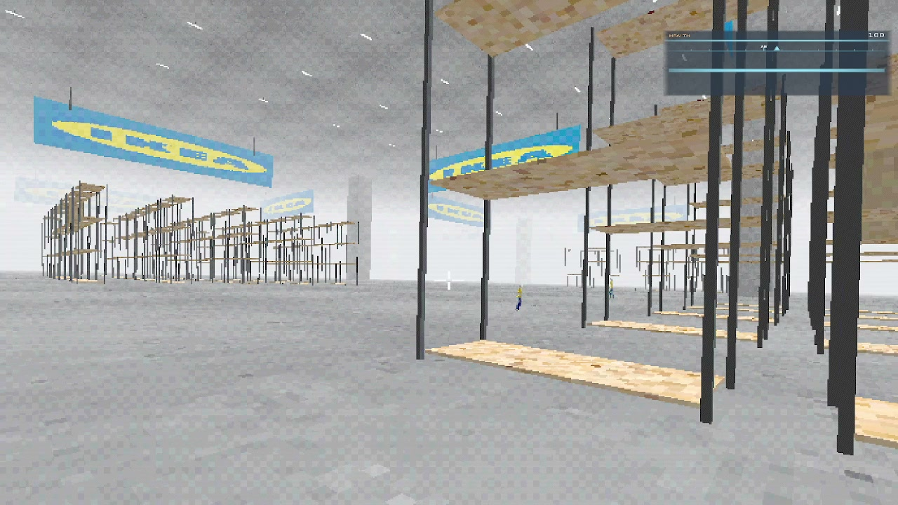

# RetroIkea

A first-person Vulkan + SDL2 game: explore a big-box store, avoid staff at night, and survive. C++17, instanced rendering, skinned characters, and a full audio mix.

**Repository:** [github.com/memesdudeguy/RetroIkea](https://github.com/memesdudeguy/RetroIkea)

## Demo

Demo video source file: **`/home/memesdudeguy/2026-03-30 21-50-04.mp4`** (same recording committed as [`media/demo.mp4`](media/demo.mp4) for the repo).

GitHub **does not show** `<video>` embeds in READMEs (they are stripped). Use the poster (click) or the link below to watch the MP4.

[](https://github.com/memesdudeguy/RetroIkea/raw/main/media/demo.mp4)

**[Open demo video (MP4)](https://github.com/memesdudeguy/RetroIkea/raw/main/media/demo.mp4)**

## Requirements

- **CMake** 3.16+
- **Vulkan** 1.1+ (driver + [Vulkan SDK](https://www.lunarg.com/vulkan-sdk/) or `glslc` on `PATH`)
- **SDL2** and **SDL2_image**
- **Python** 3.6+ (embeds some assets at configure time)

On Arch Linux, typical packages: `vulkan-devel`, `sdl2`, `sdl2_image`, `cmake`, `python`.

## Build (Linux)

```bash
cmake -S . -B build
cmake --build build -j
./build/vulkan_game
```

The Linux binary target name is `vulkan_game`. Run it from the repo root so `assets/` resolves correctly, or set paths as described in `CMakeLists.txt` / compile definitions.

## Build (Windows)

Native MinGW/MSVC: see [`packaging/windows_build_and_setup.txt`](packaging/windows_build_and_setup.txt). The shipped Windows executable name is **`RetroIkea.exe`**.

Cross-compile from Linux (MinGW-w64) uses the same CMake project with `-DCMAKE_SYSTEM_NAME=Windows` and a Windows Vulkan import library; details are in that packaging doc.

## Installer (Windows)

With [Inno Setup](https://jrsoftware.org/isinfo.php) 6 installed:

```bash
iscc packaging/windows_setup.iss
```

Produces `packaging/RetroIkea-Beta-Setup.exe` (installer) that installs `RetroIkea.exe` and the `assets` folder. That file is not committed here (it is large); upload it as a [GitHub Release](https://docs.github.com/en/repositories/releasing-projects-on-github/managing-releases-in-a-repository) asset instead.

## Online lobby (browser server list)

The game can list public hosts via a small HTTP API in [`server/`](server/). Set the environment variable **`RETRO_IKEA_LOBBY_URL`** to the deployed service origin with **no trailing slash** (for example `https://retro-ikea-lobby.onrender.com`).

- **Run locally:** see [`server/README.md`](server/README.md).
- **Host on Render:** connect this GitHub repo in [Render](https://render.com) and use **Blueprint** → paste [`render.yaml`](render.yaml) at the repo root, or create a **Web Service** with root directory `server`, build `pip install -r requirements.txt`, start `uvicorn main:app --host 0.0.0.0 --port $PORT`.

GitHub hosts **source only** for the lobby; the Python process must run on a platform like Render, Railway, or Fly.io.

## Push this repo to GitHub

If the remote is empty ([RetroIkea](https://github.com/memesdudeguy/RetroIkea.git)):

```bash
git init
git add .
git commit -m "Initial import: RetroIkea game"
git branch -M main
git remote add origin https://github.com/memesdudeguy/RetroIkea.git
git push -u origin main
```

**Authentication:** GitHub does **not** accept your account password for `git push` over HTTPS. Use one of these:

1. **HTTPS + Personal Access Token (PAT)** — [Create a token](https://github.com/settings/tokens) (classic: enable `repo`). When `git push` asks for a password, paste the **token**, not your GitHub password.
2. **SSH** — [Add an SSH key](https://docs.github.com/en/authentication/connecting-to-github-with-ssh) to your GitHub account, then:
   ```bash
   git remote set-url origin git@github.com:memesdudeguy/RetroIkea.git
   git push -u origin main
   ```
3. **GitHub CLI** — `pacman -S github-cli` then `gh auth login` and push as usual.

## Inno Setup under Wine (Linux)

There is no `iscc` in Arch repos; install Inno Setup with Wine (download [is.exe](https://jrsoftware.org/isdl.php)), then compile from the **project root** (this folder is named `retro ikea`):

```bash
wine "$HOME/.wine/drive_c/Program Files (x86)/Inno Setup 6/ISCC.exe" \
  "Z:\\home\\$(whoami)\\Downloads\\retro ikea\\packaging\\windows_setup.iss"
```

Adjust the `Z:\\...` path if your clone lives elsewhere. Output: `packaging/RetroIkea-Beta-Setup.exe` (see `OutputBaseFilename` in `packaging/windows_setup.iss`).

## License

No license file is included yet; add one if you want to clarify redistribution.
